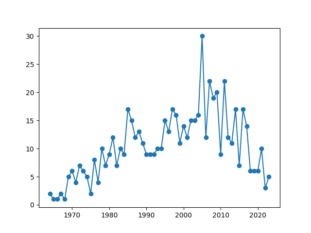
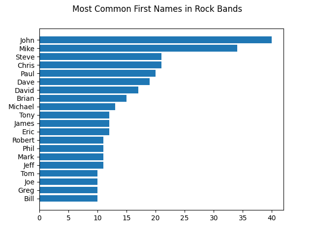
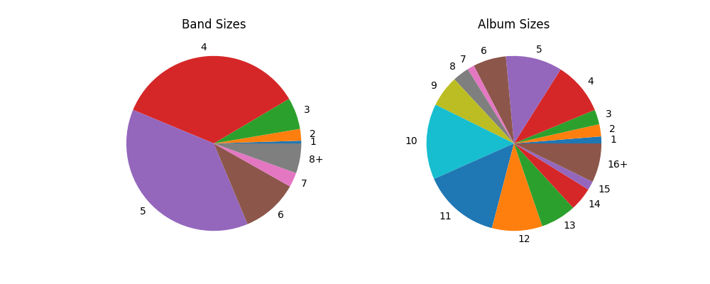
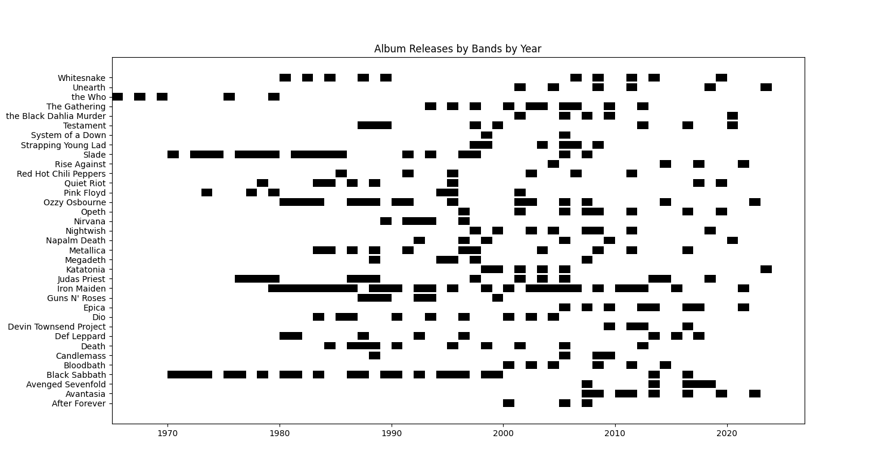

## Házi feladat

Készíts diagramokat az `albums.zip`-ben található adatok alapján!

A zip-ben található `albums` mappában az almappák egy-egy rockbanda albumait tárolják.
Az almappa neve a banda neve, a JSON fájlok nevei az albumok címei.
A hibás fájlokat hagyd figyelmen kívül!

Az albumon lévő számok címei a `tracks`, a zenészek nevei a `personnel` tömbben találhatóak, a megjelenés éve pedig a `year` kulcs értéke.

### 1. Feladat

Készíts vonaldiagramot, ami az egyes években megjelent albumok számát mutatja!

### 2. Feladat

Készíts sávdiagramot, ami a leggyakoribb (legtöbb személy által használt) keresztneveket ábrázolja fentről lefelé csökkenő sorrendben!

Csak a legalább 10-szer előforduló neveket jelenítsd meg!
Tekintsd keresztnévnek minden név első szavát!
Két személy megegyezik, ha a teljes nevüket tartalmazó stringek egyenlők.

### 3. Feladat

Készíts egy ábrát, amin 2 tortadiagram szerepel: a bandák létszámainak és az albumokon található számok darabszámainak relatív gyakorisága.

A 8 vagy nagyobb létszámokat egyesítsd egyetlen "8+" tortaszeletbe, összeadva az előfordulások számát.
Hasonlóan a 16+ számot tartalmazó albumokkal.
A diagram kategóriái (bandák és albumok méretei) legyenek rendezett sorban!

### 4. Feladat

Számold össze, hogy az egyes bandák hány albumot adtak ki!
Azokkal dolgozz tovább, akik legalább 5 albumot adtak ki!

Jelenítsd meg a bandák albumainak számát sávdiagramon!

### 5. Feladat

A 4. Feladatban kiválogatott bandák album-megjelenéseit ábrázold egy Gantt-diagramot formáló sávdiagramon!

A vízszintes tengely mutassa az éveket, és azoknál a bandáknál jelenjen meg fekete téglalap az adott évben, akik adtak ki legalább 1 albumot abban az évben!

